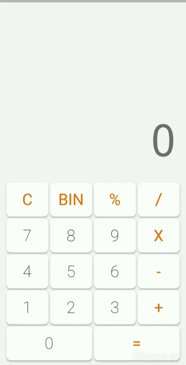

# Calculadora em flutter

### O intuito era converter um número em binário para decimal, porém novas funcionalidades serão adicionadas ainda.



### Por mais que o Dart possua uma forma de realizar a conversão, o intuito não foi utilizar funções prontas, mas sim, treinar a lógica de programação, segue abaixo o algorítmo adotado para realizar a conversão:

```dart

List<String> _comandos = [];
  int valor = 0;

  List<String> inverterListaComandos(List<String> comandosParametro) {
    List<String> listaComandosInvertida = [];

    for (int i = (comandosParametro.length - 1); i >= 0; i--) {
      listaComandosInvertida.add(comandosParametro[i]);
    }

    return listaComandosInvertida;
  }

  int converterBinParaDecimal() {
    int resultadoConversao = 0;

    List<String> listaInvertida = inverterListaComandos(_comandos);

    for (int i = 0; i < listaInvertida.length; i++) {
      if (int.parse(listaInvertida[i]) == 1) {
        resultadoConversao += int.parse(listaInvertida[i]) * pow(2, i);
      }
    }
    valor = resultadoConversao;
    return resultadoConversao;
  }

```

### No Dart, é possível converter Binário para Decimal da seguinute forma:

```dart
var converter = int.parse(numBinario, radix: 2).toRadixString(10);

```

